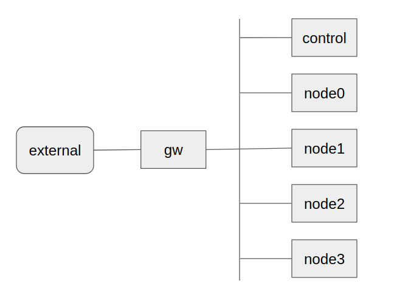
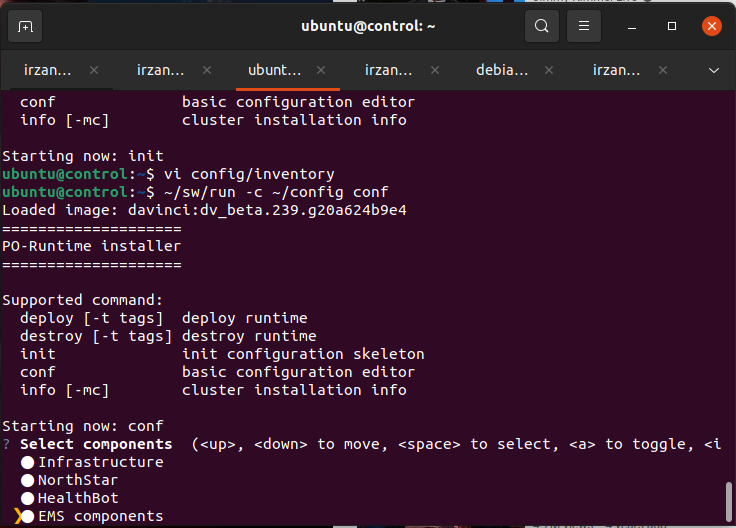
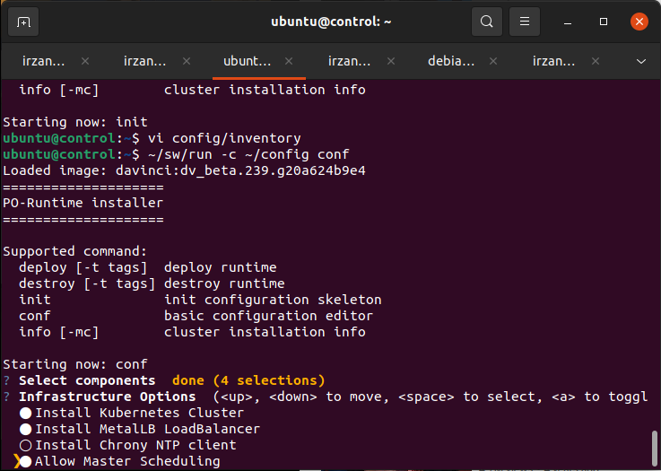
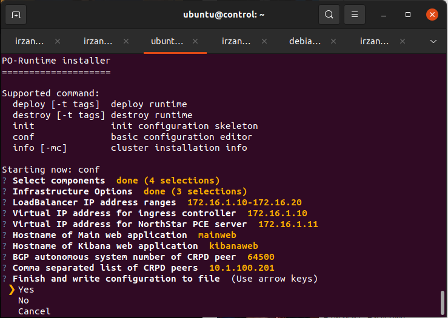
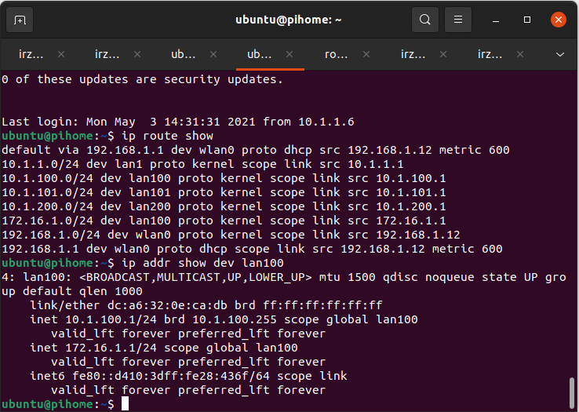

# How to install paragon beta
This document provide guideline on how to install juniper's Paragon automation software (beta version).
The software will be install on VM (virtual machine).
The hypervisor used in this document is Linux KVM.

this procedure has been tested on Linux ubuntu 20.04 where the server has 128G RAM + 2 x 500G HD + XEON CPU

## Topology 

## Parameters

### IP address

Nodes | IP address | function
-|-|-
control | 10.1.100.109/24 | Deployer node
node0 | 10.1.100.110/24 | k8s master node
node1 | 10.1.100.111/24 | k8s worker node
node2 | 10.1.100.112/24 | k8s worker node
node3 | 10.1.100.113/24 | k8s worker node

### IP pool for loadbalancer 
 IP pool | Range of ip
 -|-
 IP Pool for load balancer | 172.16.1.10 - 172.16.1.20

 ### virtual IP address 
 name | VIP
 -|-
 Web Dashboard | 172.16.1.10
 PCE Server | 172.16.1.11

## Creating disk image for ubuntu VM
1. Download ubuntu 18.04 cloud image from https://cloud-images.ubuntu.com/bionic/current/
2. Copy the image file into **ubuntu.img**
3. Resize the disk image to 300Gbye

        qemu-img resize ubuntu.img 300G
4. Create cdrom iso file to provide initial configuration into the ubuntu image for the first boot.

    a. Create a directory , for example , ~/seed

        mkdir ~/seed

    b. inside directory ~/seed, create two files, **meta-data** and **user-data**, with following content

       - meta-data
         instance-id: local-001

       - user-data
         #cloud-config
         password: pass01
         chpasswd: { expire: False }
         ssh_pwauth: True

       or you can use the following script to create the files

            cat > meta-data << EOF
            instance-id: local-001
            EOF
            cat > user-data << EOF
            #cloud-config
            password: pass01
            chpasswd: { expire: False }
            ssh_pwauth: True
            EOF

    c. create the the cdrom iso file using the following command 

        genisoimage -output ../seed.iso -volid cidata -joliet -rock user-data meta-data

    d. to verify that the cdrom iso file is created properly, try to mount it to local directory

        sudo mount -o loop seed.img /media/loop

    e. unmount the cdrom iso file

        sudo umount /media/loop

   
4. Create and start an ubuntu virtual machine using the following command. (change bridge **lan1** to whatever bridge available on your hypervisor. DHCP server must be available on the segment where bridge **lan1** is connected to, and it must provide internet connection.

        #!/bin/bash
        VM=ubuntu
        DISK=${VM}.img
        CDROM=seed.iso
        virt-install --name ${VM} \
            --disk ./${DISK},device=disk,bus=virtio \
            --disk ${CDROM},device=cdrom \
            --ram 2048 --vcpu 1  \
            --os-type linux --os-variant generic \
            --network bridge=lan1,model=virtio \
            --console pty,target_type=serial \
            --noautoconsole \
            --vnc  \
            --hvm --accelerate \
            --virt-type=kvm  \
            --boot hd

5. Acccess console port of the VM, using command **virsh console ubuntu**, login using user **ubuntu** and password **pass01**
6. Remove package cloud-init

        sudo apt -y remove cloud-init

6. Perform package update and upgrade

        sudo apt -y update
        sudo apt -y upgrade

7. Run the following script to install chrony (NTP client)  and docker, and configure chrony and DNS. Change the ip address of DNS server and NTP server to your local setup. (script [**install_docker.sh**](install_docker.sh))

        #!/bin/bash
        sudo sysctl --system
        sudo sed -i -e 's/#DNS=/DNS=10.1.1.1/' /etc/systemd/resolved.conf
        sudo service systemd-resolved restart
        sudo rm /etc/localtime
        sudo ln -s /usr/share/zoneinfo/Asia/Jakarta /etc/localtime
        sudo apt -y install apt-transport-https ca-certificates curl gnupg lsb-release chrony
        sudo sed -i -e '/^pool/d' /etc/chrony/chrony.conf
        sudo sed -i -e '$ a server 10.1.1.1 iburst' /etc/chrony/chrony.conf
        sudo systemctl restart chrony
        

8. Shutdown the VM and undefine the VM from the KVM

        virsh undefine ubuntu

9. Reduce the size of the disk image using this command

        qemu-img convert -O qcow2 -c ubuntu.img ubuntu.qcow2

10. the original disk image, **ubuntu.img** can be deleted.

## Creating, start, and setup VMs for Juniper Paragon software
The following steps are used to create and start VMs required for Juniper paragon software.
there are four VM, control host (1x), node0 as master (1x), and worker nodes (node1, node2, node3) (3x)
1. create directory where the VM's image for Juniper Paragon software will be stored
2. Copy file **ubuntu.img** (from the previous step ), into this directory
3. copy file **ubuntu.img** into file **control.img**, **node0.img**, **node1.img**, **node2.img**, and **node3.img**

        for i in control node0 node1 node2 node3
        do
            cp ubuntu.qcow2 ${i}.img
        done

4. Run the following script on the hypervisor to set hostname, ip address and change the DNS/NTP information on the VMs [**edit_vm.sh**](edit_vm.sh). Change the ip address to match your network configuration

        #!/bin/bash
        sudo mkdir /media/nbd
        # the ip address start from 10.1.100.109
        BASE=109
        GW=10.1.100.1
        NTP=10.1.100.1
        DNS=10.1.100.1
        for i in control node0 node1 node2 node3
        do
            echo "changing configuration for disk image ${i}"
            IP="10.1.100.${BASE}/24"
            BASE=`expr ${BASE} + 1`
            sudo modprobe nbd
            sudo qemu-nbd --connect /dev/nbd0 ./${i}.img
            sleep 1
            sudo mount /dev/nbd0p1 /media/nbd
            echo ${i} | sudo tee /media/nbd/etc/hostname
            echo "10.1.100.109  control" | sudo tee -a /media/nbd/etc/hosts
            echo "10.1.100.110  node0" | sudo tee -a /media/nbd/etc/hosts
            echo "10.1.100.111  node1" | sudo tee -a /media/nbd/etc/hosts
            echo "10.1.100.112  node2" | sudo tee -a /media/nbd/etc/hosts
            echo "10.1.100.113  node3" | sudo tee -a /media/nbd/etc/hosts
            sudo sed -i -e "s/dhcp4: true/dhcp4: false/g" /media/nbd/etc/netplan/50-cloud-init.yaml
            sudo sed -i -e "/match:/d" /media/nbd/etc/netplan/50-cloud-init.yaml
            sudo sed -i -e "/set-name/d" /media/nbd/etc/netplan/50-cloud-init.yaml
            sudo sed -i -e "/macaddress/d" /media/nbd/etc/netplan/50-cloud-init.yaml
            sudo sed -i -e "/version/d" /media/nbd/etc/netplan/50-cloud-init.yaml
            echo "            addresses: [ ${IP} ]" | sudo tee -a /media/nbd/etc/netplan/50-cloud-init.yaml
            echo "            gateway4: ${GW}" | sudo tee -a /media/nbd/etc/netplan/50-cloud-init.yaml
            echo "            nameservers:" | sudo tee -a /media/nbd/etc/netplan/50-cloud-init.yaml
            echo "                addresses: [ ${DNS} ]" | sudo tee -a /media/nbd/etc/netplan/50-cloud-init.yaml
            sudo sed -i -e '/^server/d' /media/nbd/etc/chrony/chrony.conf
            echo "server ${NTP} iburst" | sudo tee -a /media/nbd/etc/chrony/chrony.conf
            sudo sed -i -e '/^DNS=/d' /media/nbd/etc/systemd/resolved.conf
            echo "DNS=${DNS}" | sudo tee -a /media/nbd/etc/systemd/resolved.conf
            sudo umount /media/nbd
            sleep 1
            sudo qemu-nbd --disconnect /dev/nbd0
            sleep 3
            sudo rmmod nbd
            sleep 2
        done
        sudo rmdir /media/nbd

5. Run the following script to start the VMs (script [**install_vm.sh**](install_vm.sh))

        #!/bin/bash
        VM=control
        DISK=${VM}.img
        BRIDGE=lan100
        virt-install --name ${VM} \
            --disk ./${DISK},device=disk,bus=virtio \
            --ram 12288 --vcpu 2  \
            --os-type linux --os-variant generic \
            --network bridge=${BRIDGE},model=virtio \
            --console pty,target_type=serial \
            --noautoconsole \
            --vnc  \
            --hvm --accelerate \
            --virt-type=kvm  \
            --boot hd

        for VM in {0..4}
        do
            DISK=node${VM}.img
            virt-install --name ${VM} \
                --disk ./${DISK},device=disk,bus=virtio \
                --ram 20480 --vcpu 8  \
                --os-type linux --os-variant generic \
                --network bridge=${BRIDGE},model=virtio \
                --console pty,target_type=serial \
                --noautoconsole \
                --vnc  \
                --hvm --accelerate \
                --virt-type=kvm  \
                --boot hd
        done

6. Login into VM **control**, create the ssh-key, and copy them into other VMs (node0, node1, node2, node3)

        ssh ubuntu@10.1.100.109
        ssh-keygen -t rsa
        for i in node0 node1 node2 node3
        do
            ssh-copy-id ${i}
        done

7. Verify that from VM **control**, you can ssh into other VM without using password
        ssh ubuntu@node1

8. On VM **control**, run the following script to verify that the system UUID of VM master, node1, node2 and node3 are unique. If they are not unique, then kubernetes installation may fail.

        for i in node0 node1 node2 node3
        do
            echo VM $i :  `ssh ${i} "sudo cat /sys/class/dmi/id/product_uuid"`
        done

9. on VM **control**, install docker . Use the following script [install_docker.sh](install_docker.sh)

        #!/bin/bash
        curl -fsSL https://download.docker.com/linux/ubuntu/gpg | sudo gpg --dearmor -o /usr/share/keyrings/docker-archive-keyring.gpg
        echo "deb [arch=amd64 signed-by=/usr/share/keyrings/docker-archive-keyring.gpg] https://download.docker.com/linux/ubuntu $(lsb_release -cs) stable" | sudo tee /etc/apt/sources.list.d/docker.list > /dev/null
        sudo apt -y update
        # sudo apt -y install docker-ce docker-ce-cli containerd.io
        sudo apt -y install docker-ce=5:18.09.9~3-0~ubuntu-bionic docker-ce-cli=5:18.09.9~3-0~ubuntu-bionic containerd.io
        sudo apt-mark hold docker-ce docker-ce-cli

        sudo mkdir /etc/docker
        cat <<EOF | sudo tee /etc/docker/daemon.json
        {
        "exec-opts": ["native.cgroupdriver=systemd"],
        "log-driver": "json-file",
        "log-opts": {
            "max-size": "100m"
        },
        "storage-driver": "overlay2"
        }
        EOF

        sudo systemctl enable docker
        sudo systemctl daemon-reload
        sudo systemctl restart docker
        sudo usermod -a -G docker ubuntu

## installing Juniper Paragon Software
1. login into VM **control**, and create a directory ~/sw

        mkdir ~/sw

2. Download the paragon software into VM **control** and put them into directory ~/sw
3. create directory ~/config to store the configuration required the installation

        mkdir ~/config

4. From home directory, use the script ~/sw/run  to initialize directory ~/config

        pwd
        ~/sw/run -c ~/config init

5. edit file ~/config/inventory, add the following entries

        [master]
        node0
        [node]
        node1
        node2
        node3
        [all:vars]
        ansible_user=ubuntu
        ansible_password=pass01
        ansible_become_password=pass01
        ansible_ssh_key_file=~/.ssh/id_rsa
        

6. From home directory, use script **~/sw/run -c config conf** to configure the installer, and it will start the wizard. Please refer to the documentation on the option that you have to choose/enable

        ~/sw/run -c ~/config conf

7. This is my configuration 

7. From home directory, use script **~/sw/run -c config deploy** to install the paragon software. Get some coffee and something to eat. Wait until it finish (it may take 30 to 60 minutes to finish)

         ~/sw/run -c ~/config deploy

8. On node GW, add secondary ip address 172.16.1.1/24

